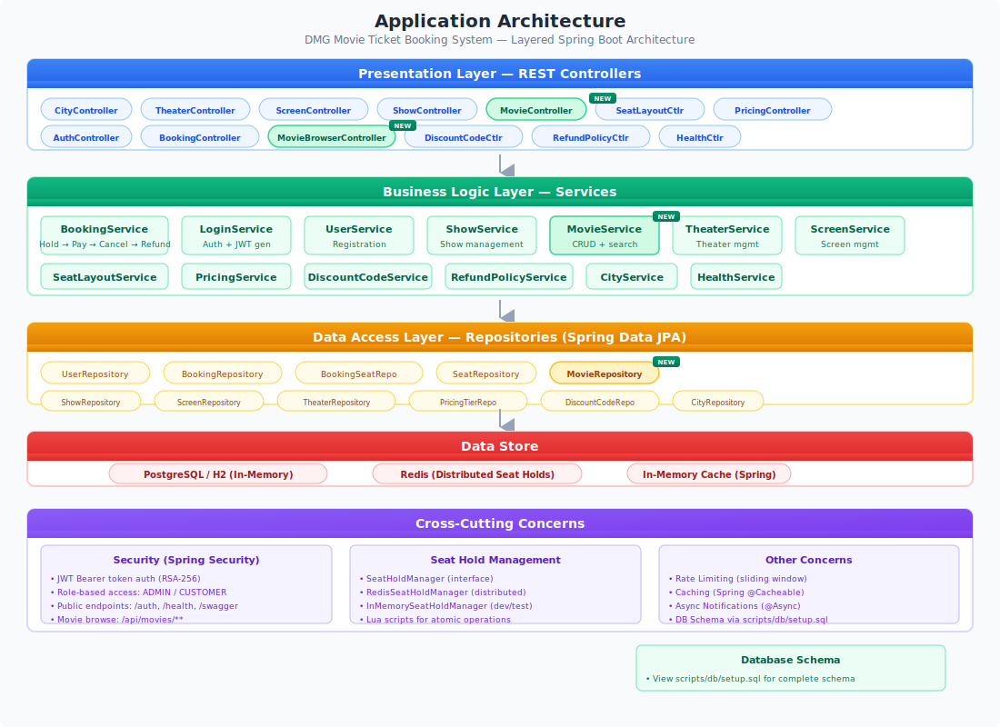
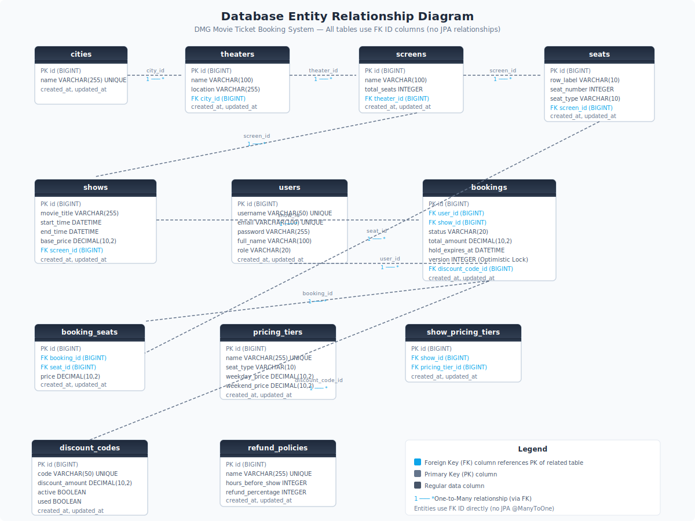
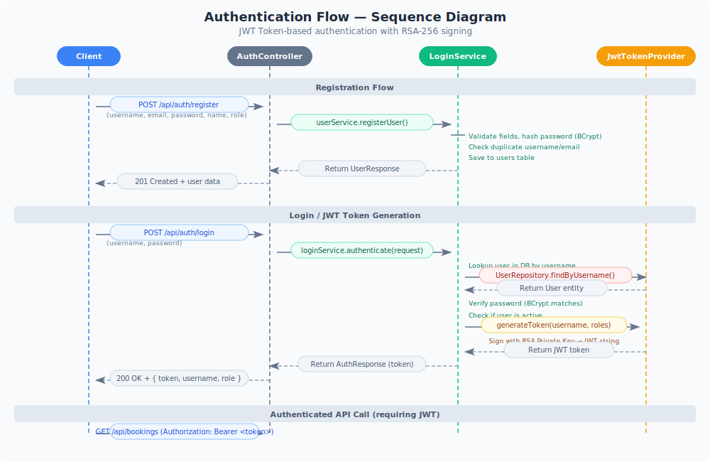
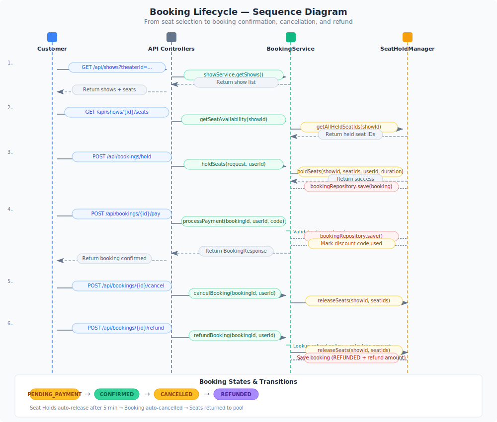
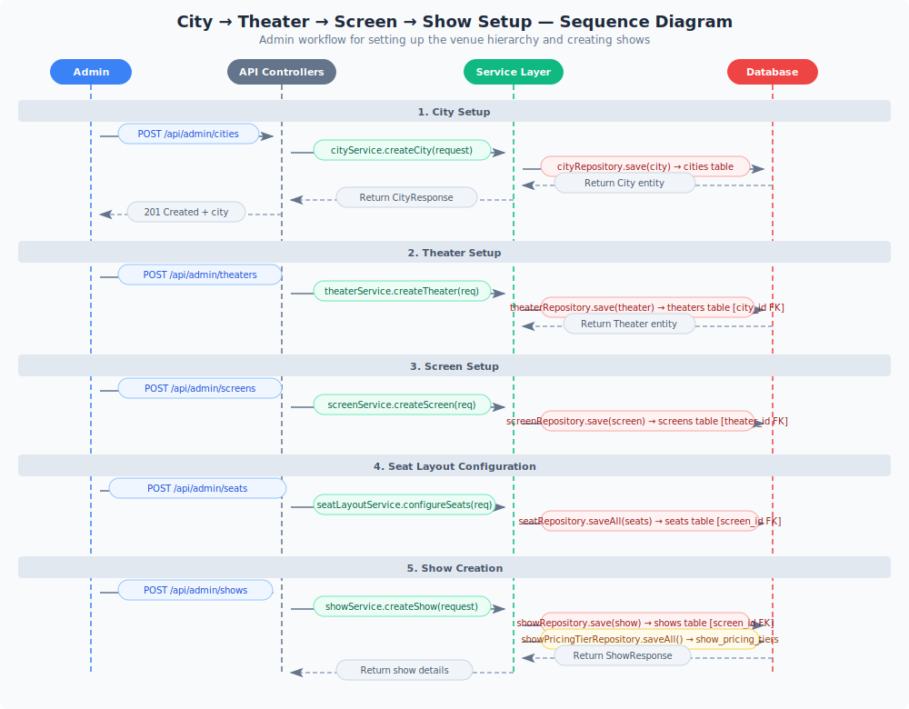

# Technical Architecture Documentation

> **DMG Movie Ticket Booking System** — Architecture overview, design decisions, data flows, and API sequences.

---

## Table of Contents

1. [Architecture Overview](#architecture-overview)
2. [Technology Stack](#technology-stack)
3. [System Architecture](#system-architecture)
4. [Database Design](#database-design)
5. [Business Decisions & Design Rationale](#business-decisions--design-rationale)
6. [Application Flows](#application-flows)
7. [API Contracts](#api-contracts)
8. [Security Architecture](#security-architecture)
9. [Concurrency & Race Condition Handling](#concurrency--race-condition-handling)
10. [Error Handling & Rate Limiting](#error-handling--rate-limiting)

---

## Architecture Overview

The DMG Movie Ticket Booking System is built on a **layered Spring Boot architecture** with clear separation of concerns:

```
Presentation Layer     →    Business Logic Layer     →    Data Access Layer     →    Database
(REST Controllers)          (Services)                    (Repositories)             (PostgreSQL/H2)
```

Key characteristics:

| Characteristic | Details |
|---------------|---------|
| **Architecture Style** | Monolithic (single deployable JAR) |
| **API Style** | RESTful JSON over HTTP |
| **Authentication** | JWT Bearer Tokens (RSA-256 signed) |
| **Authorization** | Role-based (ADMIN / CUSTOMER) |
| **Database** | PostgreSQL (production) / H2 (development) |
| **Caching** | Spring `@Cacheable` for frequently accessed data |
| **Seat Hold Management** | Redis (distributed) or In-Memory (dev/test) |
| **Concurrency** | Atomic seat holds + Optimistic locking (`@Version`) |
| **Notifications** | Asynchronous (`@Async`) log-based notifications |

---

## Technology Stack

| Technology | Version | Purpose |
|-----------|---------|---------|
| Java | 17 (LTS) | Core language |
| Spring Boot | 3.2.0 | Application framework |
| Spring Data JPA / Hibernate | — | ORM & database access |
| Spring Security | — | Authentication & RBAC |
| Spring Validation | — | Request payload validation |
| PostgreSQL | 15+ | Primary database |
| H2 Database | — | In-memory development database |
| Redis | 7+ | Distributed seat hold management |
| Lombok | — | Boilerplate reduction |
| SpringDoc OpenAPI | 2.3.0 | API documentation (Swagger UI) |
| JWT (jjwt) | 0.12.x | JSON Web Token generation & validation |
| BCrypt | — | Password hashing |
| JUnit 5 + Mockito | — | Testing |
| Maven | 3.8+ | Build & dependency management |

---

## System Architecture



### Layer 1: Presentation Layer (REST Controllers)

The controllers handle HTTP request/response processing, validation, and Swagger documentation.

| Controller | Base Path | Role |
|-----------|-----------|------|
| `AuthController` | `/api/auth` | Login & Registration |
| `BookingController` | `/api/bookings` | Booking lifecycle |
| `ShowController` (Admin) | `/api/admin/shows` | Show CRUD |
| `CityController` (Admin) | `/api/admin/cities` | City CRUD |
| `ScreenController` (Admin) | `/api/admin/screens` | Screen CRUD |
| `TheaterController` (Admin) | `/api/admin/theaters` | Theater CRUD |
| `SeatLayoutController` (Admin) | `/api/admin/seats` | Seat layout config |
| `PricingController` (Admin) | `/api/admin/pricing-tiers` | Pricing tiers |
| `DiscountCodeController` (Admin) | `/api/admin/discount-codes` | Discount codes |
| `RefundPolicyController` (Admin) | `/api/admin/refund-policies` | Refund policies |
| `HealthController` | `/api/health` | Health check |

**Cross-cutting:** `JwtAuthenticationFilter` intercepts all requests (except public endpoints) to validate JWT tokens and set the SecurityContext.

### Layer 2: Business Logic Layer (Services)

Services encapsulate all business rules and transaction boundaries. Key services:

| Service | Responsibility |
|---------|---------------|
| `BookingService` | Complete booking lifecycle: hold → pay → cancel → refund |
| `LoginService` | User authentication & JWT generation |
| `UserService` | User registration & profile management |
| `ShowService` | Show CRUD (admin) + seat availability queries |
| `SeatLayoutService` | Configuring seat layout for screens |
| `PricingService` | Pricing tier management |
| `DiscountCodeService` | Discount code validation & redemption |
| `RefundPolicyService` | Refund policy lookup & calculation |
| `NotificationService` | Async notifications (log-based stub) |
| `CityService` | City management |
| `TheaterService` | Theater management |
| `ScreenService` | Screen management |
| `HealthService` | System health check |

### Layer 3: Data Access Layer (Repositories)

Spring Data JPA repositories providing CRUD and custom query methods.

### Layer 4: Data Stores

| Store | Purpose |
|-------|---------|
| **PostgreSQL / H2** | Primary data store for all entities |
| **Redis** | Distributed seat hold management (production) |
| **In-Memory Cache** | Spring cache abstraction for frequently accessed data |

### Cross-Cutting Concerns

| Concern | Implementation |
|---------|---------------|
| **Security** | Spring Security + JWT filter |
| **Rate Limiting** | Sliding window algorithm (configurable) |
| **Caching** | `@Cacheable` on repositories/services |
| **Async Processing** | `@Async` for notifications |
| **Exception Handling** | `@ControllerAdvice` global handler |
| **API Documentation** | SpringDoc OpenAPI (Swagger UI at `/swagger-ui/index.html`) |

---

## Database Design



### Entity Summary

| Table | Description | Key FK References |
|-------|-------------|-------------------|
| `cities` | City master data | — |
| `theaters` | Theaters within cities | `city_id` → `cities.id` |
| `screens` | Screens within theaters | `theater_id` → `theaters.id` |
| `seats` | Individual seats in screens | `screen_id` → `screens.id` |
| `shows` | Movie showtimes | `screen_id` → `screens.id` |
| `users` | User accounts (Admin/Customer) | — |
| `bookings` | Booking transactions | `user_id` → `users.id`, `show_id` → `shows.id`, `discount_code_id` → `discount_codes.id` |
| `booking_seats` | Individual seat bookings | `booking_id` → `bookings.id`, `seat_id` → `seats.id` |
| `pricing_tiers` | Pricing configuration by seat type | — |
| `show_pricing_tiers` | Junction: show ↔ pricing tiers | `show_id` → `shows.id`, `pricing_tier_id` → `pricing_tiers.id` |
| `discount_codes` | One-time-use discount codes | — |
| `refund_policies` | Configurable refund rules | — |

### Design Decisions

1. **No JPA relationships**: All tables use plain FK ID columns (`Long`) instead of `@ManyToOne`/`@OneToMany` annotations. References are resolved manually in service layers. This provides:
   - Explicit control over query loading
   - No risk of N+1 queries from lazy loading
   - Clear separation between entities
   - Simpler serialization (no circular references)

2. **Soft references**: Each entity carries only FK IDs, not full object references. Service code manually looks up related entities when needed.

3. **Optimistic locking**: The `bookings` table has a `@Version` column to prevent race conditions during concurrent refund operations.

4. **Timestamp lifecycle**: All entities have `created_at` and `updated_at` managed by `@CreationTimestamp` and `@UpdateTimestamp`.

---

## Business Decisions & Design Rationale

### 1. Seat Hold & Auto-Release

**Decision:** When a user holds seats, the hold is time-bound (default: 5 minutes). If payment isn't completed within the window, the hold auto-expires and seats return to the pool.

**Rationale:**
- Prevents seat blocking by malicious/inactive users
- Balances user experience (enough time to pay) with availability (seats released quickly)
- A scheduled cleanup thread runs every 30 seconds to auto-cancel expired PENDING_PAYMENT bookings

**Flow:**
```
Hold Seats → PENDING_PAYMENT (hold_expires_at = now + 5min)
  ├── Payment within window → CONFIRMED (seats locked)
  ├── Cancel within window → CANCELLED (seats released)
  └── Timeout expired → Auto-CANCELLED (seats released by cleanup thread)
```

### 2. Seat Hold Storage: Redis vs In-Memory

**Decision:** Dual implementation via `SeatHoldManager` interface:
- **RedisSeatHoldManager**: For production with Lua scripts for atomic operations
- **InMemorySeatHoldManager**: For development/testing

**Rationale:**
- Redis provides distributed seat hold management across multiple app instances
- In-memory is simpler for local development without Redis dependency
- Configurable via `booking.hold.manager` property (default: `redis`)

### 3. Pricing Model

**Decision:** Dynamic pricing based on:
- **Seat type**: REGULAR, PREMIUM, VIP
- **Day type**: Weekday vs Weekend pricing
- **Show base price**: Per-show multiplier
- **Discount codes**: Fixed-amount deductions (one-time-use)

**Rationale:**
- Standard industry practice in movie ticketing
- Flexible enough for premium pricing (e.g., weekend surcharge)
- Discount codes support promotional campaigns

### 4. Refund Policy

**Decision:** Configurable refund policies with time-based tiers:

| Cancellation Window | Refund % |
|--------------------|----------|
| > 24 hours before show | 100% |
| 2–24 hours before show | 50% |
| < 2 hours before show | 0% |

**Rationale:**
- Theaters can configure policies per their business rules
- Encourages early cancellations to free up seats
- Prevents last-minute abuse

### 5. Discount Codes (One-Time-Use)

**Decision:** Each discount code can be used exactly once. Once marked as `used`, it cannot be reused. If payment fails/times out, the code remains valid.

**Rationale:**
- Prevents discount code sharing/reuse
- Atomic update ensures no double-spending
- Failed payments don't waste the discount code

### 6. Async Notifications (Log-Based)

**Decision:** All notification events (booking confirmation, cancellation, refund, reminders) are sent asynchronously via `@Async` and logged to a dedicated `NOTIFICATION` logger.

**Rationale:**
- Non-blocking — booking flow is not slowed down by notification sending
- Log-based stub is simple for development; can be swapped for real email/SMS
- Separate logger allows filtering notification logs
- Events are traceable for debugging

### 7. JWT Authentication (RSA-256)

**Decision:** JWT tokens signed with RSA-256 (asymmetric key pair).

**Rationale:**
- Asymmetric keys: private key signs, public key verifies
- Public key can be shared without compromising security
- Tokens include username and roles
- Stateless — no server-side session storage
- Configurable expiration (default: 24 hours)

### 8. Optimistic Locking for Refunds

**Decision:** `@Version` annotation on `Booking` entity prevents concurrent refund operations.

**Rationale:**
- Prevents double-refund race condition
- Spring Data JPA automatically checks version on update
- Throws `OptimisticLockException` on conflict, which is caught and handled

### 9. Caching Strategy

**Decision:** Spring `@Cacheable` on frequently accessed data: cities, theaters, screens, seats, shows, pricing tiers, refund policies, discount codes, users.

**Rationale:**
- Reduces database load for read-heavy operations
- Cache is invalidated on write operations via `@CacheEvict`
- Simple in-memory cache (can be swapped for Redis in production)

---

## Application Flows

### Authentication Flow



**Step-by-step:**

1. **Registration** (`POST /api/auth/register`):
   - Validate input (username, email, password, full name, role)
   - Check for duplicate username/email
   - Hash password with BCrypt
   - Save user to database
   - Return `201 Created` with user details

2. **Login** (`POST /api/auth/login`):
   - Lookup user by username
   - Verify password with BCrypt
   - Check if account is active
   - Generate JWT token (signed with RSA private key)
   - Return `200 OK` with `{ token, username, role }`

3. **Authenticated API Call**:
   - Client sends `Authorization: Bearer <token>` header
   - `JwtAuthenticationFilter` extracts and validates the token
   - Sets `SecurityContext` with user identity and roles
   - Controller proceeds with role-based access

### Booking Flow



**Step-by-step:**

1. **Browse Shows** → `GET /api/shows?theaterId=...`
   - Returns list of shows with movie title, timing, screen info

2. **View Seat Availability** → `GET /api/shows/{showId}/seats`
   - Returns seats with status: `AVAILABLE`, `HELD`, or `BOOKED`
   - Cross-references database (booked seats) + cache (held seats)

3. **Hold Seats** → `POST /api/bookings/hold`
   - Validates seats belong to show's screen
   - Attempts to hold seats in SeatHoldManager (Redis/In-Memory)
   - If another user holds some seats → `409 Conflict`
   - Creates booking with `PENDING_PAYMENT` status
   - Sets `hold_expires_at = now + 5 minutes`
   - Sends async notification

4. **Process Payment** → `POST /api/bookings/{id}/pay`
   - Validates ownership and `PENDING_PAYMENT` state
   - Checks hold expiry (rejects if expired)
   - Optional: validates and applies discount code
   - Updates booking to `CONFIRMED`
   - Marks discount code as used (if applicable)
   - Calculates final amount (total - discount)
   - Sends async confirmation notification

5. **Cancel Booking** → `POST /api/bookings/{id}/cancel`
   - Validates ownership (any state except already cancelled/refunded)
   - Releases seat holds
   - Updates booking to `CANCELLED`

6. **Refund Booking** → `POST /api/bookings/{id}/refund`
   - Validates ownership and `CONFIRMED` state
   - Looks up applicable refund policy based on time until show
   - Calculates refund amount
   - Uses `@Version` optimistic locking to prevent double-refund
   - Releases seat holds
   - Updates booking to `REFUNDED` with refund amount
   - Sends async refund notification

### City → Theater → Screen → Show Setup (Admin)



**Setup order:**
1. Create City → `POST /api/admin/cities`
2. Create Theater → `POST /api/admin/theaters` (references city_id)
3. Create Screen → `POST /api/admin/screens` (references theater_id)
4. Configure Seats → `POST /api/admin/seats` (references screen_id)
5. Create Show → `POST /api/admin/shows` (references screen_id)

---

## API Contracts

### Public Endpoints

| Method | Endpoint | Auth Required | Role |
|--------|----------|--------------|------|
| GET | `/api/health` | No | — |
| POST | `/api/auth/login` | No | — |
| POST | `/api/auth/register` | No | — |

### Admin Endpoints (require `ADMIN` role)

| Method | Endpoint | Description |
|--------|----------|-------------|
| POST | `/api/admin/cities` | Create city |
| GET | `/api/admin/cities` | List cities |
| POST | `/api/admin/theaters` | Create theater |
| GET | `/api/admin/theaters?cityId={id}` | List theaters |
| POST | `/api/admin/screens` | Create screen |
| POST | `/api/admin/seats` | Configure seat layout |
| POST | `/api/admin/shows` | Create show |
| GET | `/api/admin/shows?theaterId={id}` | List shows |
| POST | `/api/admin/pricing-tiers` | Create a pricing tier |
| GET | `/api/admin/pricing-tiers` | List all pricing tiers |
| PUT | `/api/admin/pricing-tiers/{id}` | Update a pricing tier |
| POST | `/api/admin/discount-codes` | Create discount code |
| POST | `/api/admin/refund-policies` | Create a refund policy |
| GET | `/api/admin/refund-policies` | List all refund policies |
| PUT | `/api/admin/refund-policies/{id}` | Update a refund policy |
| GET | `/api/admin/cities/{id}` | Get city by ID |
| PUT | `/api/admin/cities/{id}` | Update a city |
| DELETE | `/api/admin/cities/{id}` | Delete a city |
| GET | `/api/admin/theaters/{id}` | Get theater by ID |
| GET | `/api/admin/shows/{id}` | Get show by ID |
| GET | `/api/admin/screens/{id}` | Get screen by ID |
| GET | `/api/admin/screens?theaterId={id}` | List screens in a theater |

### Customer Endpoints (require `ADMIN` or `CUSTOMER` role)

| Method | Endpoint | Description |
|--------|----------|-------------|
| GET | `/api/cities` | List cities |
| GET | `/api/theaters?cityId={id}` | List theaters |
| GET | `/api/shows?theaterId={id}` | List shows |
| GET | `/api/shows/{showId}/seats` | View seat availability |
| POST | `/api/bookings/hold` | Hold seats |
| POST | `/api/bookings/{id}/pay` | Complete payment |
| POST | `/api/bookings/{id}/cancel` | Cancel booking |
| POST | `/api/bookings/{id}/refund` | Request refund |
| GET | `/api/bookings/{id}` | View booking detail |
| GET | `/api/bookings` | View authenticated user's booking history |

Default credentials:

| Role | Username | Password |
|------|----------|----------|
| Admin | `admin` | `admin123` |
| Customer | `customer` | `customer123` |

---

## Security Architecture

### JWT Token Flow

1. **Login**: User provides credentials → `LoginService` authenticates → `JwtTokenProvider` generates a signed JWT
2. **Token Format**: Header (RSA-256) + Payload (sub: username, roles: [...], iat, exp) + Signature
3. **Validation**: `JwtAuthenticationFilter` extracts Bearer token → verifies with RSA public key → extracts username/roles → sets Spring Security context
4. **Authorization**: `SecurityConfig` defines URL → role mappings:
   - `/api/admin/**` → `ROLE_ADMIN`
   - `/api/bookings/**`, `/api/shows/**`, `/api/cities`, `/api/theaters` → `ROLE_ADMIN` or `ROLE_CUSTOMER`
   - `/api/auth/**`, `/api/health`, `/swagger-ui/**`, `/v3/api-docs/**`, `/h2-console/**` → Public

### Key Configuration

```
jwt.private-key-path=keys/private.pem
jwt.public-key-path=keys/public.pem
jwt.expiration-ms=86400000  (24 hours)
```

---

## Concurrency & Race Condition Handling

The system handles several concurrency scenarios:

| Scenario | Mechanism | Details |
|----------|-----------|---------|
| **Double-booking** | Atomic seat hold operations | Redis Lua scripts / synchronized in-memory manager ensure a seat can only be held by one user |
| **Payment race condition** | JPA optimistic locking (`@Version`) | Prevents lost updates on concurrent payment processing |
| **Double-refund** | Optimistic locking | `@Version` on `Booking` entity throws `OptimisticLockException` if two refund requests process simultaneously |
| **Hold auto-release** | Scheduled cleanup thread | Runs every 30 seconds to cancel expired `PENDING_PAYMENT` bookings and release seats |
| **Concurrent seat hold check** | Atomic cache operations | Redis eval (Lua script) or `synchronized` block on InMemory manager |
| **Discount code double-use** | Database atomic update | Status check + update in same transaction |

---

## Error Handling & Rate Limiting

### Standard Error Response Format

```json
{
  "status": 400,
  "error": "Bad Request",
  "message": "Seat 42 is already held by another user",
  "path": "/api/bookings/hold",
  "timestamp": "2026-07-17T10:30:00Z"
}
```

### HTTP Status Codes Used

| Code | Usage |
|------|-------|
| `200 OK` | Successful GET, POST, PUT, DELETE |
| `201 Created` | Successful resource creation |
| `400 Bad Request` | Validation errors, invalid state transitions |
| `401 Unauthorized` | Missing/invalid JWT token |
| `403 Forbidden` | Insufficient role permissions |
| `404 Not Found` | Resource not found |
| `409 Conflict` | Seat already held, concurrent modification |
| `429 Too Many Requests` | Rate limit exceeded |
| `500 Internal Server Error` | Unexpected errors |

### Rate Limiting

- **Algorithm**: Sliding window (configurable)
- **Default**: 100 requests per minute per client
- **Implementation**: `RateLimitingInterceptor` + `SlidingWindowCache`
- **Response**: `429 Too Many Requests` with retry-after header

---

## Diagrams Index

| Diagram | File | Description |
|---------|------|-------------|
| Entity Relationship Diagram | [er-diagram.svg](diagrams/er-diagram.svg) | All tables, columns, and FK relationships |
| Application Architecture | [application-architecture.svg](diagrams/application-architecture.svg) | Layered architecture with cross-cutting concerns |
| Auth Flow Sequence | [sequence-auth-flow.svg](diagrams/sequence-auth-flow.svg) | Registration, login, and JWT token authentication |
| Booking Flow Sequence | [sequence-booking-flow.svg](diagrams/sequence-booking-flow.svg) | Complete booking lifecycle: hold → pay → cancel → refund |
| Show Management Sequence | [sequence-show-management.svg](diagrams/sequence-show-management.svg) | City → Theater → Screen → Seat → Show setup flow |

---

*Last updated: July 17, 2026*
